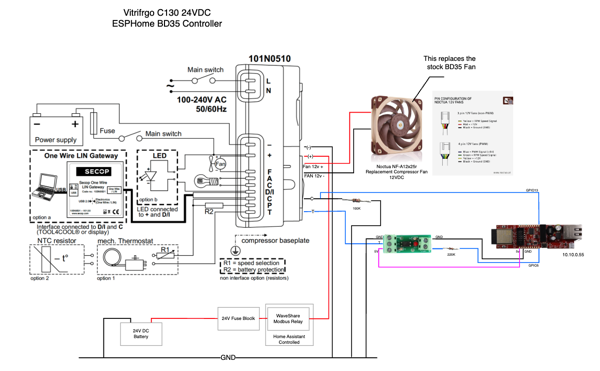

# ESPHOME Danfoss BD35 Controller

This system enables smart, efficient cooling control for a Danfoss BD35 compressor-based
refrigerator, integrating Home Assistant and an ESP32.

## Features

1. Hybrid Adaptive Cooling (Inside + Outside Temp-Based)
   - Adjusts compressor speed dynamically based on:
     - Fridge temperature relative to configurable thresholds
     - Ambient temperature compensation
   - Includes hysteresis protection:
     - Minimum 60-second delay between power changes
     - 5% minimum change threshold to prevent micro-adjustments
     - Safe fallback to 50% power if sensors fail

2. Configurable Temperature Thresholds
   - High temperature threshold (6-15°C)
   - Normal temperature threshold (3-8°C)
   - Low temperature threshold (0-5°C)
   - All adjustable via Home Assistant

3. Performance Monitoring
   - Compressor runtime tracking (hours)
   - Cycle counting
   - Current cooling power display (%)

4. Operating Modes
   - Turbo Mode (30-minute full power boost)
   - Manual Override Mode
   - Automatic fallback to adaptive cooling

5. Hardware Control
   - PWM Compressor Speed Control (ESP32 → BD35 "C" Terminal)
     - Dynamic speed control (2,000-3,500 RPM)
     - Minimum 12% duty cycle safety limit
   - Optocoupler-based ON/OFF Control (ESP32 → BD35 "T" Terminal)

6. Network Connectivity
   - Primary: Ethernet (LAN8720)
   - Fallback: WiFi with Access Point mode
   - Home Assistant integration with encryption

7. Power Optimization
   - Intelligent speed control based on cooling demand
   - Hysteresis protection prevents unnecessary cycling
   - Ambient temperature compensation

## Hardware Requirements

| Category | Component | Purpose |
|----------|-----------|---------|
| Main Controller | ESP32 Development Board | Controls cooling logic, runs ESPHome |
| Fridge Sensors | Ruuvi BLE Temp Sensor (Inside fridge) | Reads internal fridge temperature |
| | Ambient Temp Sensor (Ruuvi, DHT22, or BME280) | Reads outside temperature |
| Compressor Speed Control | ESP32 GPIO13 (PWM Output) → BD35 C Terminal | Controls compressor speed dynamically |
| | 100kΩ Resistor (BD35 C Terminal → GND) | Stabilizes PWM signal |
| Compressor ON/OFF Control | Optocoupler on GPIO5 → BD35 T Terminal | Isolated control for BD35 T Terminal |

## Wiring Diagram

| ESP32  |  Resistor | Optocoupler      | BD35       |
|--------|-----------|------------------|------------|
| GPIO5  | 220kΩ     | Positive (Input) |            |
| GND    |           | Negative (Input) |            |
| 5V     |           | VCC (Output)     |            |
|        |           | GND (Output)     | GND        |
|        |           | OUT (Output)     | T Terminal |
| GPIO13 |           |                  | C Terminal |
|        | 100kΩ     |                  | C Terminal |



## Configuration Instructions

### 1. Edit the YAML Configuration

Before deploying, you need to customize the `bd35_controller.yaml` file to match
your hardware and setup.

#### Network Configuration

Only the Ethernet or the WiFi configuration can be used at a time. Comment out or delete
the unused configuration.

If using Ethernet, ensure the configuration matches your hardware. You can find the necessary details in the
   [ESPHOME documentation](https://esphome.io/components/ethernet).

If using WiFi:

- wifi_ssid: Your WiFi network name.
- wifi_password: Your WiFi network password.
- fallback_password: Password for the fallback access point.
- Replace the placeholder encryption key in the api section with a valid Base64-encoded 32-byte key.

#### **Temperature Sensors**

Configure the sensors for fridge and ambient temperature readings using substitutions at the top of the file. These should point to Home Assistant entity IDs.

```yaml
substitutions:
temp_refrigerator: "sensor.ruuvitag_refrigerator_temp"
temp_exterior: "sensor.ruuvitag_exterior_temp"
gpio_compressor_switch: "GPIO5"
gpio_compressor_speed: "GPIO13"
```

The sensors will be automatically configured based on these substitutions:

```yaml
sensor:
   # Fridge Temperature (from Home Assistant via BLE Ruuvi)
   - platform: homeassistant
      entity_id: ${temp_refrigerator}
      id: fridge_temp
      internal: true

   # Ambient Temperature (External Sensor or Home Assistant)
   - platform: homeassistant
      entity_id: ${temp_exterior}
      id: ambient_temp
      internal: true
```

#### Temperature Thresholds

1. Adjust the default thresholds for fridge temperature if needed:

   ```yaml
   number:
   - platform: template
      name: "High Temperature Threshold"
      initial_value: 10.0  # Adjust as needed
   - platform: template
      name: "Normal Temperature Threshold"
      initial_value: 4.0  # Adjust as needed
   - platform: template
      name: "Low Temperature Threshold"
      initial_value: 2.0  # Adjust as needed
    ```

2. Upload Files to Home Assistant

   In the repo, the `homeassistant` folder contains the `bd35_controller.yaml` file to the esphome
   folder in your Home Assistant configuration directory. You then copy the components folder to the
   `esphome` folder in your Home Assistant configuration directory. Keep the folder structure. You may
   or may not need to create the `components` folder in the `esphome` directory.

   Open the ESPHome add-on in Home Assistant.
   Add the bd35_controller.yaml configuration.
   Compile and upload the firmware to your ESP32 directly from the ESPHome dashboard.

3. Build and Install the Firmware to the ESP32 Development Board

   I'm going to assume you know how to do all this, but you briefly:

      1. go to ESPHome Builder in Home Assistant.
      2. select the bd35_controller.yaml file.
      3. Edit the configuration as needed if you didn't already.
      4. Test compile the firmware, the easiest way to do this is to run Install but and use the
         Manual Download option from the Install dialog. This keeps your hardware network, etc.
         out of the equation, and validates the yaml file, your paths, etc.
      5. If the test compile passes, you can then upload the firmware to your ESP32 board either over
         the network or via USB.

## Repository Structure

| Path                       | Description                                                                                     |
|----------------------------|-------------------------------------------------------------------------------------------------|
| `homeassistant/esphome/bd35_controller.yaml` | Main ESPHome configuration for the BD35 compressor controller. Includes hardware-specific configurations and defines all sensors, controls, and automation logic. |
| `homeassistant/esphome/components/`      | Directory containing external components for modular logic (e.g., adaptive cooling).            |
| `.pre-commit-config.yaml`  | Configuration for pre-commit hooks that run automated checks on code before committing.         |
| `.yamllint.yaml`           | Custom rules for YAML linting, including ESPHome-specific configurations.                       |
| `.markdownlint.yaml`       | Enforces consistent Markdown formatting to maintain clean and professional documentation.      |
| `.github/workflows/`       | GitHub Actions workflows for automated checks and validations on pull requests.                 |
